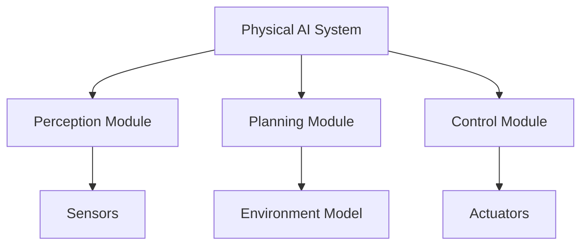

## Technical Deep Dive

Provide in-depth technical content including:

### Architecture Considerations

Detailed architecture for embodied systems:



### Framework Implementation

Implementation details using appropriate frameworks:

```python
# Example: Robot control implementation
class PhysicalAIFramework:
    def __init__(self):
        self.perception = PerceptionModule()
        self.planning = PlanningModule() 
        self.control = ControlModule()
    
    def execute(self, goal):
        # Process using embodied intelligence principles
        pass
```

### APIs and Interfaces

Define key APIs and interfaces:

- **API 1**: Purpose and usage in physical AI systems
- **API 2**: Integration with robotics frameworks
- **API 3**: Connection to hardware interfaces

### Pipelines

Detail important processing pipelines:

1. **Pipeline 1**: Data flow and processing steps
2. **Pipeline 2**: Integration with other system components
3. **Pipeline 3**: Performance and safety considerations

### Mathematical Foundations

Include relevant mathematical concepts:

$$ \text{Embodied Intelligence Formula} = f(\text{sensing}, \text{reasoning}, \text{acting}) $$

### ROS 2/Gazebo/Isaac/VLA Integration

Specific implementation details for major robotics platforms:

<Tabs>
<TabItem value="ros2" label="ROS 2">

```python
# ROS 2 specific implementation
import rclpy
from rclpy.node import Node
```

</TabItem>
<TabItem value="gazebo" label="Gazebo">

```xml
<!-- Gazebo specific configurations -->
<sdf version="1.7">
  <model name="robot">
    <link name="base_link">
      <visual>
        <geometry>
          <box size="0.1 0.1 0.1"/>
        </geometry>
      </visual>
    </link>
  </model>
</sdf>
```

</TabItem>
<TabItem value="isaac" label="Isaac Sim">

```python
# Isaac Sim specific implementation
from omni.isaac.core import World
```

</TabItem>
</Tabs>

### Performance and Safety Considerations

- **Performance**: Optimization for real-time physical systems
- **Safety**: Safety measures for physical robot implementation
- **Reliability**: Robustness in real-world conditions

> **Note**: All technical content must consider the physical embodiment of AI systems as required by the Physical AI constitution's emphasis on embodied intelligence principles.